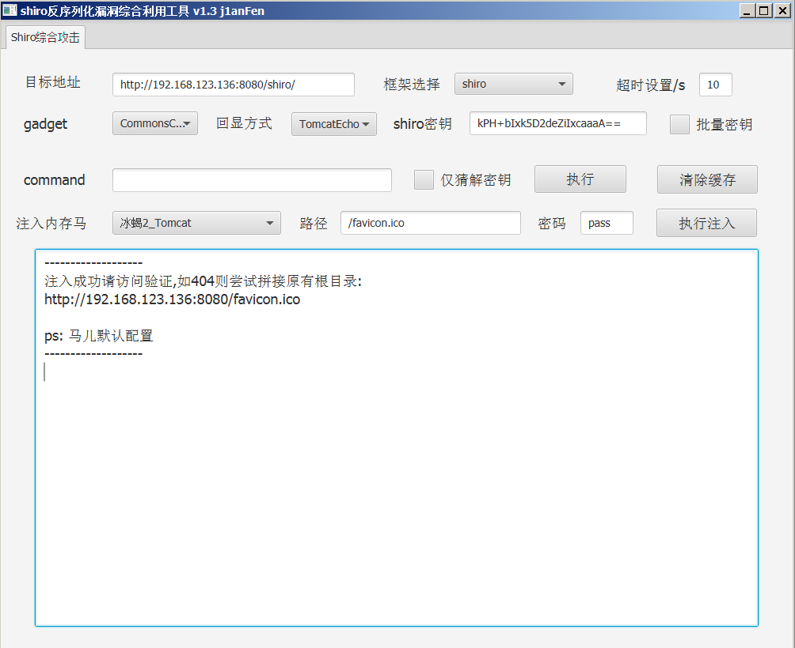

# shiro反序列化漏洞综合利用

项目基于javafx,利用shiro反序列化漏洞进行回显命令执行以及注入各类内存马

1. 通过deleteMe的返回检出默认key (SimplePrincipalCollection)
2. tomcat/springboot环境下回显命令执行
3. 集成CommonsCollectionsK1/K2
4. 通过POST请求中执行字节码实现注入内存马（参考哥斯拉内存马Servlet实现）

## 关于内存马
1. 某些spring环境以jar包启动写shell麻烦
2. 渗透中找目录很烦,经常出现各种写shell浪费时间问题
3. 无落地文件舒服

## bug修复
2020.11.08
1. 高低版本base64库不一致,目前使用org.apache.shiro.codec.Base64避免此问题

## 参考链接
- [ysoserial](https://github.com/zema1/ysoserial)
- [Godzilla](https://github.com/BeichenDream/Godzilla)
- [基于Tomcat无文件Webshell研究](https://mp.weixin.qq.com/s/whOYVsI-AkvUJTeeDWL5dA)
- [小姐姐带你看Shiro反序列化漏洞利用](https://mp.weixin.qq.com/s/WDmj4-2lB-hlf_Fm_wDiOg)
- [Java代码执行漏洞中类动态加载的应用](https://mp.weixin.qq.com/s?__biz=MzAwNzk0NTkxNw==&mid=2247484622&idx=1&sn=8ec625711dcf87f0b6abe67483f0534d)

